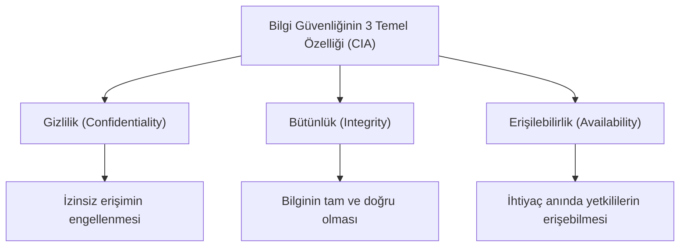
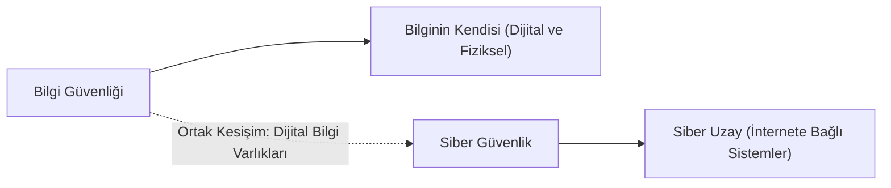
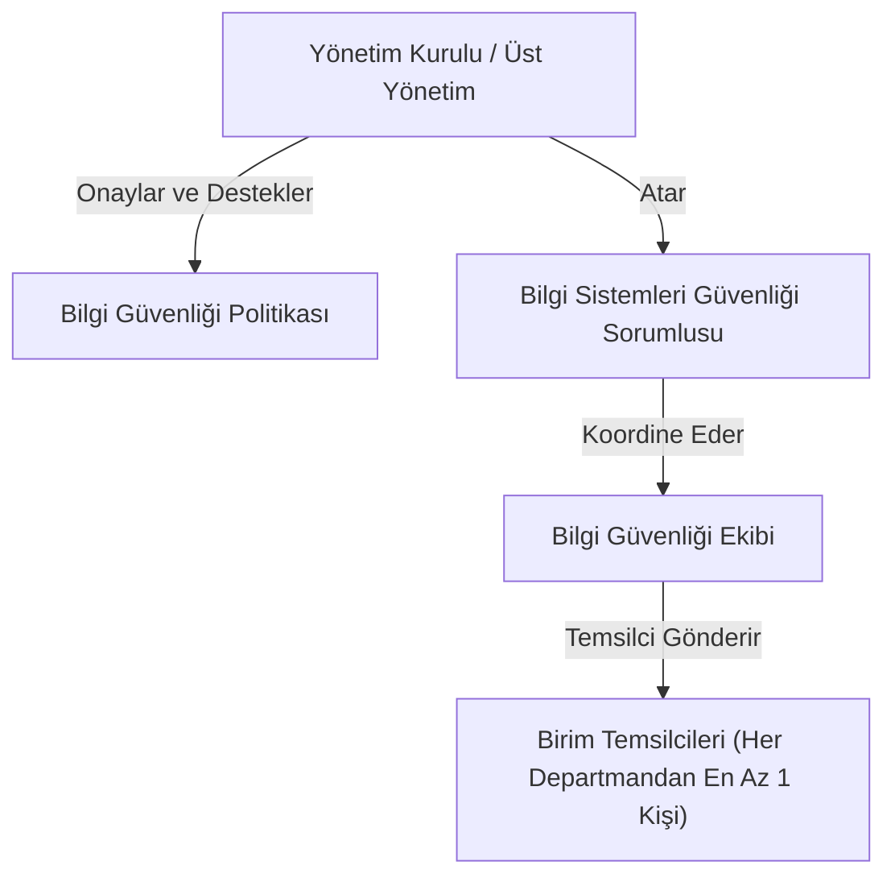
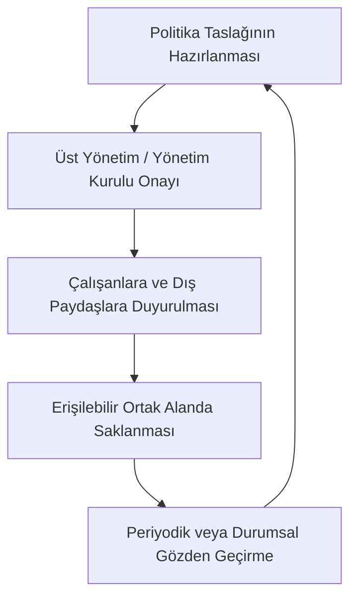
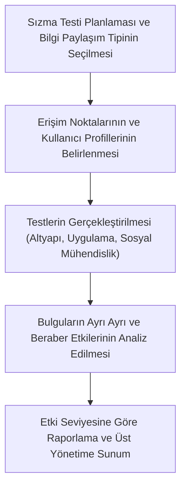
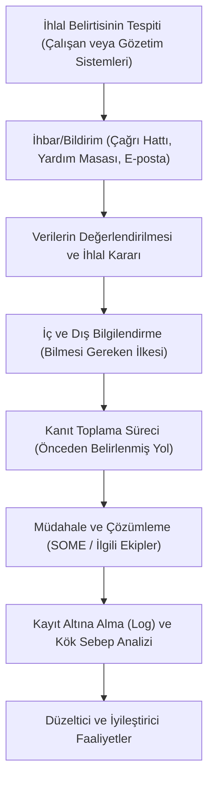
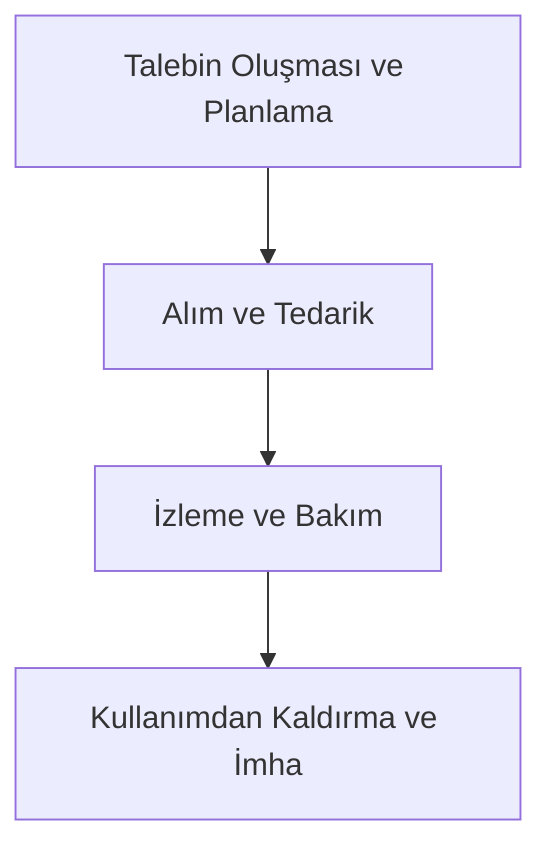

## 📌 Bilgi Sistemleri Güvenliği [Bilgi Güvenliği Yönetimi]

### 🎯 Bu Bölüm Ne Anlatıyor?
Bilgi güvenliği yönetimi kavramsal çerçevesi, siber güvenlik ile bilgi güvenliği arasındaki temel farklar, siber uzay tanımları, üst yönetimin sorumlulukları ile kurumsal roller ve sorumluluklar ele alınmaktadır.

---

### 🏢 Konu 1: Bilgi Güvenliği Yönetimi ve Temel Kavramlar [Bilgi Güvenliği Yönetimi]

Bilgi güvenliği, teknolojik ekipmanların fiziksel korunmasıyla başlayan sınırlarını aşarak, günümüzde siber uzayın tamamını kapsayan küresel bir güvence mekanizmasına dönüşmüştür. Kurumsal düzeyde makul bir güvence oluşturmak amacıyla ISO/IEC 27001:2013 gibi uluslararası standartlar temel alınmaktadır.

*   **Kavram Tanımları ve Mikro-Senaryolar:**
    *   **Bilgi Güvenliği Yönetimi:** Kurumda bilgi güvenliğinin kabul edilebilir düzeyde korunmasını sağlamak amacıyla geliştirilen ve kullanılan tüm mekanizmalardır. Bunlar; organizasyonel yapılar, politika ve prosedürler, süreçlerdir ve çeşitli varlıklardır.
        *   💡 *Benzetme:* Bir kalenin sadece surlarını değil; nöbetçi çizelgelerini, giriş-çıkış kurallarını, acil durum planlarını ve içerideki hazinelerin listesini yöneten tüm idari ve askeri sistemdir.
        *   🎬 *Mikro-Senaryo - Beta Portföy AŞ Yönetim Sistemi:* Beta Portföy AŞ, müşteri verilerinin korunması amacıyla sadece sunucu şifrelerini değiştirmekle kalmaz; çalışanların uyması gereken temiz masa politikasını yazar, ihlal prosedürlerini belirler ve tüm bu süreçleri Genel Müdürlük seviyesinde onaylatarak yürütür.
    *   **Gizlilik (Confidentiality):** Bilgiye izinsiz erişimlerin engellenmesi.
        *   💡 *Benzetme:* Mühürlü bir mektup zarfı; sadece üzerinde adı yazan alıcı açıp okuyabilir, yoldaki postacı veya başkaları içeriği göremez.
        *   🎬 *Mikro-Senaryo - Alfa Yatırım AŞ Müşteri Bilgileri:* Alfa Yatırım AŞ bünyesinde çalışan bir veri analisti, sadece kendi yetki alanındaki portföy raporlarına erişebilirken, insan kaynakları departmanının maaş bordrolarına erişimi sistem tarafından engellenmiştir.
    *   **Bütünlük (Integrity):** Bilginin tam ve doğru olması.
        *   💡 *Benzetme:* Bir banka dekontundaki tutarın yolda veya veritabanında değiştirilememesi, gönderilen 10.000 TL'nin alıcıya tam olarak 10.000 TL olarak ulaşmasıdır.
        *   🎬 *Mikro-Senaryo - Gama Portföy AŞ Emir İletimi:* Gama Portföy AŞ Portföy Yöneticisi sisteme 500 adet pay alım emri girdiğinde, bu emir sistemsel bir hata veya araya giren kötü niyetli bir yazılım tarafından değiştirilmeden, tam ve doğru olarak borsaya ulaşır.
    *   **Erişilebilirlik (Availability):** Bilginin ihtiyaç duyulduğunda yetkili taraflarca erişilebilir olması.
        *   💡 *Benzetme:* Acil bir durumda banka kasasındaki paranıza veya mobil şubeye anında ulaşıp işlem yapabilmenizdir; kasanın anahtarının kaybolmaması veya sistemin çökmemesidir.
        *   🎬 *Mikro-Senaryo - Delta Menkul Değerler AŞ Sunucu Kesintisi:* Delta Menkul Değerler AŞ müşterileri, piyasanın en hareketli saatinde mobil uygulamaya sorunsuz şekilde giriş yaparak portföylerini görüntüleyebilir ve işlem gerçekleştirebilirler. Yedekli sunucu altyapısı sayesinde sistem her an aktif kalır.

---

### 🏢 Konu 2: Siber Güvenlik ve Siber Uzay Kavramları [Siber Güvenlik Standartları]

Siber güvenlik ve bilgi güvenliği kavramları sıklıkla birbirinin yerine kullanılsa da odak noktaları ve koruma alanları açısından farklılık gösterirler. Siber güvenlik, özellikle internete bağlı ağlardaki veri ve sistemlerin korunmasını amaçlar.

*   **Kavram Tanımları ve Mikro-Senaryolar:**
    *   **Siber Güvenlik (NIST Tanımı):** Saldırıları önleyerek, tespit ederek ve bunlara yanıt vererek bilgileri koruma süreci.
        *   💡 *Benzetme:* Sürekli devriye gezen, hırsızlık girişimlerini önceden sezen, alarm çaldığında anında müdahale eden ve hasarı onaran dinamik bir özel güvenlik timi.
        *   🎬 *Mikro-Senaryo - Omega Bankası Siber Savunma Merkezi:* Omega Bankası Siber Olaylara Müdahale Ekibi (SOME), bankanın dış ağlarına yönelik gerçekleştirilen bir hizmet dışı bırakma (DoS) saldırısını anında tespit eder, trafiği yedek hatlara yönlendirerek saldırıyı bloke eder ve sistemlerin kesintisiz çalışmasını sağlar.
    *   **Siber Güvenlik (ISO/IEC 27100 Tanımı):** İnsanların, toplumun, kuruluşların ve ulusların siber risklerden korunması.
    *   **Siber Güvenlik (Bragaru ve Briceag Tanımı):** Teknolojik cihazlar veya entegre ağlar aracılığıyla sağlanan İnternet hizmetleri, insanlar ve yazılımlar arasındaki etkileşim sürecinde ortaya çıkan karmaşık bir ortam olan siber uzayla ilgili her türlü güvenlik.
    *   **Siber Uzay (ISO/IEC 27100 Tanımı):** Ağların, hizmetlerin, sistemlerin, insanların, süreçlerin, organizasyonların ve dijital ortamda bulunan veya dijital ortamdan geçen her şeyin birbirine bağlı dijital ortamı (Bu ortam, şirket iç ağına ait bölümlerden veya herkese açık ağlarla bağlantısı olmayan, yalıtılmış (air-gapped) dijital ortamlardan ziyade Internet gibi kamusal altyapılar üzerinden geçen, birbirine bağlı dijital ortamı ifade eder)
        *   💡 *Benzetme:* Tüm dünya şehirlerini birbirine bağlayan devasa, sınırları olmayan, herkesin ortak kullandığı küresel bir otoyol ağı.
        *   🎬 *Mikro-Senaryo - Sigma Faktoring AŞ Veri Akışı:* Sigma Faktoring AŞ, şubeleri arasındaki tüm veri transferini internet üzerinden şifreli tüneller (VPN) kullanarak gerçekleştirir. Bu veri akışı, yalıtılmış yerel ağlar yerine küresel siber uzay üzerinden akar.
    *   **Siber Uzay (NIST Tanımı):** İnternet, telekomünikasyon ağları, bilgisayar sistemleri ile gömülü işlemciler ve denetleyicileri kapsayan bilgi sistemleri altyapılarının birbirine bağlı ağının oluşturduğu, bilgi ortamı içinde yer alan küresel bir alan.
    *   **Siber Güvenlik (Von Solms ve van Niekerk Tanımı):** Siber uzayın kendisinin, elektronik bilgilerin, siber uzayı destekleyen bilgi ve iletişim teknolojilerinin ve siber uzay kullanıcılarının, siber uzay kaynaklı saldırılara karşı savunmasız olan somut ya da soyut çıkarlarından herhangi biri dahil olmak üzere, kişisel, toplumsal ve ulusal kapasitelerde korunmasıdır.
    *   **Siber Güvenlik (Edgar ve Manz Tanımı):** Siber uzayda bir şeyin güvenliğini sağlamaya yönelik teknolojileri, politikaları ve prosedürleri içeren bir alan.

| Özellik | Bilgi Güvenliği | Siber Güvenlik |
| :--- | :--- | :--- |
| **Odak Noktası** | Bilginin kendisinin korunması | Siber uzayın korunması |
| **Kapsam** | Hem dijital hem de fiziksel ortamlardaki tüm bilgi varlıkları | Özellikle internete bağlı ağlardaki veri ve sistemler |
| **Uygulanan Kontroller** | İdari, teknik ve fiziksel kontroller | Siber tehditlere karşı savunma önlemleri |
| **Varlık Türü** | Kağıt belgeler, dijital veriler, fikri mülkiyet | Bilgi sistemleri, ağlar, internete bağlı cihazlar |

---

### 🏢 Konu 3: Üst Yönetimin Sorumlulukları, Roller ve Sorumluluklar [Yönetişim ve Organizasyon]

Kurumsal düzeyde bilgi güvenliği, bilginin "korunması gereken bir varlık" olarak kabul edilmesiyle başlar. Bilgi güvenliği teknik bir iş olmayıp, kurumun her kademesini ve çalışanını ilgilendirir. En üst düzeyde sahiplenilmesi zorunludur.

*   **Kavram Tanımları ve Mikro-Senaryolar:**
    *   **Üst Yönetimin Bilgi Güvenliği Sorumluluğu:** Bilgi güvenliği politikasının oluşturulması ve her yıl gözden geçirilmesi, bu kapsamda görevlendirmelerin yapılması, risk yönetiminin gerçekleştirilmesi, çalışanlarının farkındalığının sağlanması, bilgi güvenliği ihlallerinin değerlendirilmesi üst yönetime verilmiş sorumluluklardır.
        *   💡 *Benzetme:* Bir geminin kaptanının, geminin güvenli seyretmesi için rotayı belirlemesi, acil durum tatbikatları yaptırması ve güvenlik ekipmanlarını onaylaması sorumluluğudur.
        *   🎬 *Mikro-Senaryo - Beta Portföy AŞ Yönetim Kurulu Kararı:* Beta Portföy AŞ Yönetim Kurulu, her yıl Aralık ayında toplanarak bilgi güvenliği politikasını gözden geçirir, sızma testi sonuçlarını inceler ve yeni bütçe döneminde güvenlik yatırımlarına onay verir.
    *   **Bilgi Sistemleri Güvenliği Sorumlusu:** Üst yönetim tarafından bu konuyla görevlendirilmiş en az bir kişinin (tek görevi bu olmayabilir) sorumlu olarak belirlenmesi.
        *   💡 *Benzetme:* Bir fabrikadaki iş güvenliği uzmanı; kuralları denetler, riskleri raporlar ve işçileri eğitir.
        *   🎬 *Mikro-Senaryo - Zeta Portföy AŞ Ataması:* Zeta Portföy AŞ Yönetim Kurulu, Bilgi Teknolojileri Müdürü'nü aynı zamanda "Bilgi Sistemleri Güvenliği Sorumlusu" olarak görevlendirir. Bu görevlendirme yazılı olarak onaylanır ve kurum organizasyon şemasına işlenir.

*   **Bilgi Güvenliği Ekibi Yapılandırma Esasları:**
    *   Kurumun büyüklüğüne göre bir ekip oluşturulmalıdır.
    *   Ekipte kurumdaki her birimden en az bir temsilcinin yer alması önemlidir.
    *   Ekipte birimleri temsilen bulunanların, kendi birimindeki çalışmaları bilgi güvenliği ilkeleri özelinde gözden geçirecek ve gerekirse revize edecek yetkinlikte olması gerekir.
    *   Ekipçe alınan kararların birimlerde/kurumda uygulanabilir olmasını sağlayacak mekanizmalar belirlenmelidir.
    *   Bilgi güvenliği kapsamındaki her rolün görev tanımları yazılı, onaylı ve ilgililere duyurulmuş olmalıdır.
    *   Sorumlu kişi ve kişiler kurum organizasyon şemasında yer almalıdır.

*   🧠 **Hafıza Tekniği - Üst Yönetimin 5 Temel Sorumluluğu (P-A-R-F-İ):**
    *   **P**olitika oluşturma ve yıllık gözden geçirme.
    *   **A**tama ve görevlendirmelerin yapılması.
    *   **R**isk yönetiminin gerçekleştirilmesi.
    *   **F**arkındalık ve eğitimlerin sağlanması.
    *   **İ**hlal olaylarının değerlendirilmesi.

---

### 🏢 Konu 1: Farkındalık, Eğitim ve Bilgi Güvenliği Politikası [Bilgi Güvenliği Yönetimi]

Kurumsal bilgi güvenliğinin sürdürülebilirliği, sadece teknik donanımların gücüne değil, insan faktörünün bilinç düzeyine ve üst yönetimin belirlediği stratejik kurallara bağlıdır. Bu doğrultuda, çalışanların eğitilmesi ve kuralların yazılı bir politika haline getirilmesi sürecin ilk temel adımıdır.

*   **Kavram Tanımları ve Mikro-Senaryolar:**
    *   **Bilgi Güvenliği Politikası:** Kurumlar bilgi güvenliğini uygulama yaklaşımı her ne şekilde olursa olsun, bir bilgi güvenliği politikası oluşturmalıdır. Bilgi güvenliği politikası bu konuda üst yönetimin genel yaklaşımını, konuya verilen önemi, kapsamı belirlemelidir.
        *   💡 *Benzetme:* Bir ülkenin anayasası gibidir; kurum içindeki tüm alt kuralların, yetkilendirmelerin ve güvenlik prosedürlerinin dayandığı en üst ve bağlayıcı metindir.
        *   🎬 *Mikro-Senaryo - Alfa Portföy Yönetimi AŞ'nin Politika İlanı:* Alfa Portföy Yönetimi AŞ Yönetim Kurulu, şirketin tüm dijital ve fiziksel varlıklarını korumak amacıyla hazırlanan ana güvenlik politikasını onaylar. Bu politika, tüm çalışanların kolayca erişebileceği ortak ağ klasöründe yayınlanır ve her yıl düzenli olarak gözden geçirilerek güncellenir.

*   📌 **Bilgi Güvenliği Politikasının Ele Alması Gereken 7 Temel Husus:**
    *   Bilgi güvenliğinin tanımı, kapsamı ve kurumsal bilgi güvenliği hedefleri.
    *   Bilgi güvenliği ile ilgili kurumsal roller ve sorumluluklar.
    *   Risk yönetimi esasları.
    *   Tabii olunan diğer yasal düzenlemeler.
    *   Bilgi güvenliği farkındalığı ve eğitimi planlaması.
    *   Üst yönetimin bağlılığı ve bakış açısı.
    *   Bilgi güvenliği politika ve süreçlerine aykırı davranmanın olası sonuçları (yaptırımlar).

*   ⚠️ **Dış Paydaşların Durumu:** Bilgi güvenliği politikası sadece kurum çalışanlarını değil; tedarikçileri, servis sağlayıcıları, müşterileri ve iş ortaklarını (dış paydaşları) da doğrudan etkiler. Bu nedenle politika, uygun yöntemlerle tüm dış paydaşlara da duyurulmalıdır.

*   💡 **Destek Politikaları:** Kurumlar, genel politikanın yanı sıra belirli bir birimi veya iş sürecini hedef alan özel destek politikaları da oluşturabilir. Tek bir ana politika veya ayrı ayrı politika dokümanlarının tercih edilmesinde; kurumun büyüklüğü, faaliyetlerin çeşitliliği ve çalışan sayısı temel parametreler olarak kabul edilir.

---

### 🏢 Konu 2: Bilgi Sistemlerinde Risk Yönetimi ve Risk İşleme Seçenekleri [Risk Yönetimi]

Bilgi sistemleri kapsamında risk yönetimi, bilgi sistemleri kullanımından kaynaklanan risklerin yönetilmesi ve bu konuda makul bir güvence sağlanması amacını taşır. Bu süreç, kurumsal sürekliliğin korunması için varlıkların, zafiyetlerin ve tehditlerin sistematik olarak analiz edilmesini gerektirir.

*   **Kavram Tanımları ve Mikro-Senaryolar:**
    *   **Risk Belirleme Süreci (Risk Identification):** Varlıkların belirlenmesi aşamasından sonra bu varlıkların her birinin yapısından veya kullanımından kaynaklanan her türlü zafiyet (vulnerability) tespit edilmelidir. Zafiyetlerin her biri birer istismar (exploit) noktası olduğundan bu zafiyetlerden yararlanabilecek tehditler belirlenmelidir. Bu şekilde, bilgi güvenliği riskinin üç temel noktası tespit edilmiş olur ki bu risk belirleme süreci olarak tanımlanmaktadır.
        *   💡 *Benzetme:* Bir banka şubesinin kasasındaki kilidin eski olduğunu fark etmek (zafiyet), bu kilidi açabilecek hırsızlık yöntemlerinin varlığını bilmek (tehdit) ve kasadaki nakit miktarını listelemektir (varlık).
        *   🎬 *Mikro-Senaryo - Beta Aracı Kurum AŞ'nin Risk Tespiti:* Beta Aracı Kurum AŞ Bilgi Güvenliği Sorumlusu, müşteri veri tabanının tutulduğu sunucuyu (varlık) incelerken, işletim sisteminin güncel olmadığını (zafiyet) ve bu açığı hedef alan fidye yazılımlarının (tehdit) aktif olduğunu belirler. Bu üç unsuru bir araya getirerek risk belirleme sürecini tamamlar.

*   📌 **Varlık Tespiti Aşamasında Dikkate Alınan Çerçeve:**
    *   Sunucu donanımları ve depolama ortamları.
    *   Kullanıcı cihazları (bilgisayar, tablet, akıllı cihazlar).
    *   Ağ cihazları.
    *   Her türden yazılım.
    *   *Not:* "Veri" bu listede ayrı bir varlık olarak gösterilmemiştir; çünkü yukarıda sayılan tüm bilgi sistemlerini korumanın temel amacı, esasında bu varlıklar aracılığıyla işlenen, saklanan ve iletilen veriyi korumaktır.

*   ⚠️ **Risk Yönetiminde Temel İlke:** Risk yönetiminde hedef hiçbir zaman "sıfır riskli" bir ortam yaratmak değildir. Kurum, kendi risk iştahına göre kabul edilebilir bir risk eşik değeri belirler ve bu değerin üzerinde kalan riskler için risk işleme çalışması yapar. Kontrolün maliyeti, riskin gerçekleşmesi durumunda ortaya çıkacak olası maliyeti aşmamalıdır (yasal zorunluluklar bu kuralın istisnasıdır).

| Risk İşleme Seçeneği | Açıklama | Tercih Edilme Durumu / Özelliği | Örnek Senaryo |
| :--- | :--- | :--- | :--- |
| **Riski Azaltma** | Çeşitli kontroller (politika, prosedür, yazılım, donanım vb.) yardımıyla riskin düşürülmesi. | En çok tercih edilen seçenektir. | Sunucuya antivirüs yazılımı kurmak ve erişim yetkilerini kısıtlamak. |
| **Riski Engelleme** | Riske sebep olan ürünün veya hizmetin kullanımına tamamen son verilmesi. | Kontrollerle düşürülemeyecek riskler için uygulanır. | Güvenlik açığı kapatılamayan eski bir web uygulamasını tamamen yayından kaldırmak. |
| **Riski Paylaşma** | Riskin üçüncü taraflarla paylaşılması (örneğin sigorta yaptırılması). | Riskin gerçekleşme olasılığını değiştirmez, finansal etkiyi paylaşır. | Siber risk sigortası yaptırarak olası bir veri sızıntısının mali yükünü hafifletmek. |
| **Riski Kabul Etme** | Riske rağmen ürünün veya hizmetin hiçbir önlem alınmadan kullanılmaya devam edilmesi. | En kötü seçenek olarak değerlendirilir. | Bilinen bir güvenlik açığına sahip yazılımı, hiçbir ek tedbir almadan kullanmaya devam etmek. |

---

### 🏢 Konu 3: Bilgi Güvenliği Gözetimi, Ölçümü ve Sızma Testleri [Gözetim ve Denetim]

Kurulan güvenlik kontrollerinin kağıt üzerinde kalmaması, fiilen çalışıp çalışmadığının periyodik olarak gözetilmesi, ölçülmesi ve teknik yöntemlerle test edilmesi gerekir. Bu süreçte en yaygın kullanılan teknik doğrulama yöntemi sızma testleridir.

*   **Kavram Tanımları ve Mikro-Senaryolar:**
    *   **Sızma Testi Bilgi Paylaşım Tipleri:** Sistemlere ilişkin hangi tip ön bilginin paylaşıldığı (Şirket tarafından sızma testini gerçekleştirecek taraflara sistemlere ilişkin hiç bilgi verilmeyen siyah/kapalı kutu (black box), test edilecek sistemlere yönelik bilgilerin sağlandığı beyaz/açık kutu (white box) veya kısmi bilgi sağlanan gri/şeffaf kutu (gray box) gibi farklı uygulamalar olabilir) sızma testi raporunda yer almalıdır.
        *   💡 *Benzetme:* Bir binanın güvenliğini test etmek için hırsız rolündeki test ekibine binanın krokisini tamamen vermek (beyaz kutu), kısmen vermek (gri kutu) veya hiçbir bilgi vermeden sızmalarını istemektir (siyah kutu).
        *   🎬 *Mikro-Senaryo - Gama Portföy Yönetimi AŞ'nin Sızma Testi:* Gama Portföy Yönetimi AŞ, BSY Tebliği gereği yılda bir kez yapılması zorunlu olan sızma testi için bağımsız bir siber güvenlik firmasıyla anlaşır. Test ekibine sistem mimarisi hakkında hiçbir ön bilgi verilmeyerek "Siyah Kutu (Black Box)" yöntemiyle dış ağdan sızma girişimi simüle edilir ve tespit edilen bulgular etki seviyelerine göre raporlanır.

*   📌 **Sızma Testi Raporunda Yer Alması Zorunlu Olan Hususlar:**
    *   Sistemlere ilişkin hangi tip ön bilginin paylaşıldığı (Siyah, beyaz veya gri kutu).
    *   Hangi sistemlere yönelik sızma testinin gerçekleştirildiği (Altyapı, servisler, cihazlar, uygulamalar, sosyal mühendislik vb.).
    *   Hangi erişim noktalarının kullanıldığı (Internet, intranet, diğer ağlar).
    *   Hangi kullanıcı profillerinin test edildiği.
    *   Ayrı ayrı her bir bulgunun etkisi.
    *   Bulguların beraber değerlendirildiklerindeki kümülatif etkisi.

*   ⚠️ **Yasal Zorunluluk (BSY Tebliği):** Sermaye Piyasası Kurulu Bilgi Sistemleri Yönetimine İlişkin Usul ve Esaslar Tebliği (VII-128.10) uyarınca, muaf olan kurumlar hariç olmak üzere, sızma testlerinin **yılda en az 1 kere** gerçekleştirilmesi zorunludur.

---

### 🏢 Konu 1: Bilgi Güvenliği İhlal Yönetimi [Bilgi Güvenliği Yönetimi]

Kurum bünyesinde bilgi güvenliğini tehlikeye atan her türlü olayın hızlıca tespit edilmesi, kontrol altına alınması, analiz edilmesi ve gelecekte tekrarlanmaması için gerekli düzeltici faaliyetlerin yürütülmesi sürecidir.

*   **Kavram Tanımları ve Mikro-Senaryolar:**
    *   **Bilgi Güvenliği İhlali:** Bilgi sistemlerinde sonucu itibariyle bilgi veya bilgi barındıran ortamlarda bir zarara sebep olmuş veya olma ihtimali çok yüksek herhangi bir olay olarak tanımlanabilir. → 💡 *Benzetme: Şirket binasının giriş kapısının açık unutulması fiziksel bir ihlal ihtimaliyken, müşteri veri tabanındaki şifrelerin dışarı sızdırılması doğrudan gerçekleşmiş bir bilgi güvenliği ihlalidir.*
        *   🎬 *Mikro-Senaryo - Yetkisiz Erişim Girişimi:* Beta Portföy Yönetimi AŞ'de çalışan bir stajyerin, yetkisi olmadığı halde şirketin müşteri veri tabanına erişmeye çalıştığı sistem loglarında tespit edilmiştir. Bu durum, doğrudan bir veri kaybına yol açmasa bile bilgi güvenliğini tehlikeye attığı için anında bir bilgi güvenliği ihlali olarak değerlendirilmiş ve olay müdahale süreci başlatılmıştır.
    *   **Kanıt Toplama:** İhlalin fark edilmesinden sonraki en önemli süreçtir. İzlenecek yol mutlaka önceden belirlenmiş olmalıdır. → 💡 *Benzetme: Bir suç mahallindeki parmak izlerinin bozulmadan toplanması gibi, siber saldırıya uğrayan bir sunucunun bellek (RAM) imajının ve log dosyalarının değiştirilmeden, adli bilişim kurallarına uygun şekilde kopyalanmasıdır.*
        *   🎬 *Mikro-Senaryo - Kanıt Güvenliği:* Alfa Yatırım Menkul Değerler AŞ'nin web sunucusuna yapılan bir siber saldırı sonrasında, eğitimli BT personeli sunucuyu kapatmadan önce uçucu bellek (RAM) imajını güvenli bir şekilde yedeklemiştir. Önceden belirlenmiş prosedürlere uygun olarak yürütülen bu süreç sayesinde, saldırganın geride bıraktığı dijital izler mahkemede delil olarak kullanılabilecek şekilde korunmuştur.

*   **İhlal Bildirim ve Tespit Mekanizmaları:**
    *   Kurumdaki her çalışan, aldığı eğitim ve gösterdiği dikkat sayesinde bir ihlali veya ihlal belirtisini tespit edebilir.
    *   Tüm çalışanların şüphelerini iletebileceği basit, yaygınlaştırılmış ve herkes tarafından bilinen bir mekanizma (çağrı hattı, yardım masası uygulaması veya özel bir e-posta hesabı) kurulmalıdır.
    *   Bu işlemler için en az bir çalışan özel olarak görevlendirilmelidir.
    *   Gelen tüm çağrılar analiz edilmeli, ilgili ekiplere yönlendirilmeli ve çağrıyı yapan kişiye mutlaka geri bildirimde bulunulmalıdır.

*   **Siber Olaylara Müdahale ve Kayıt (Log) Süreci:**
    *   Kurum bünyesinde bir **Kurumsal Siber Olaylara Müdahale Ekibi (SOME)** yer alıyorsa, ihlal bildirimleri bu ekip tarafından ele alınır.
    *   İhlal çözümlendikten sonra, gözetim işlevi ve gelecekteki denetimler için ihlale cevaben yapılan tüm işlemler mutlaka kayıt altına (log) alınmalıdır.
    *   İhlalin kök sebebi bulunmalı ve gerekli düzeltici/iyileştirici faaliyetler gerçekleştirilmelidir. Kurum her ihlalden bir ders çıkarmalıdır.

---

### 🏢 Konu 2: Bilgi Güvenliği Yönetiminin Değerlendirilmesi [BT Bağımsız Denetim Esasları]

Kurumun bilgi güvenliği altyapısının, politikalarının ve süreçlerinin etkinliğinin bağımsız denetçiler veya iç denetim birimleri tarafından sistematik olarak kontrol edilmesi ve kanıt toplanması sürecidir.

*   **Değerlendirme Alanları ve Denetim Kriterleri:**

| Değerlendirilen Süreç | Denetim ve Kontrol Kriterleri | Toplanması Gereken Kanıtlar |
| :--- | :--- | :--- |
| **Politika ve Prosedürler** | Yazılı, üst yönetimce onaylanmış, tüm personele duyurulmuş ve düzenli gözden geçiriliyor mu? | Onaylı politika dokümanları, duyuru e-postaları, gözden geçirme toplantı tutanakları. |
| **Farkındalık ve Eğitim** | Tüm personel en az bir kere bilgi güvenliği eğitimi almış mı? | Eğitim katılım kayıtları, sertifikalar, eğitim materyalleri. |
| **Risk Yönetimi** | Geçmiş risk değerlendirmeleri yazılı olarak mevcut mu? Kabul edilebilir risk seviyesi yönetimce onaylanmış mı? Risk azaltma kararı verilen varlıklar için yapılacaklar (ne, kim, ne zaman) belli mi? | Yazılı risk değerlendirme raporları, yönetim kurulu onay kararları, risk işleme planları. |
| **İzleme ve Ölçme** | İzleme/ölçme süreci etkin mi? Ölçüm sonuçları üst yönetimce değerlendiriliyor mu? | Ölçüm raporları, üst yönetim sunumları ve değerlendirme kayıtları. |
| **İhlal Yönetimi** | Geçmiş ihlal kayıtları mevcut mu? Kimlerin haberdar edildiği, toplanan kanıtlar, yapılan işlemler ve kök sebep tespiti incelenmiş mi? | İhlal logları, bildirim kayıtları, kök sebep analiz raporları, düzeltici faaliyet formları. |

*   **Kavram Tanımları ve Mikro-Senaryolar:**
    *   **Bilmesi Gereken İlkesi (Need to Know):** Bilgi güvenliği ihlali gerçekleştiğinde veya normal operasyonel süreçlerde, bilginin sadece görevi gereği bu bilgiye ihtiyaç duyan kişilerle paylaşılması esasıdır. → 💡 *Benzetme: Bir askeri operasyonda planın tamamının sadece komuta kademesinde kalması, cephedeki askere ise sadece kendi koordinatlarının verilmesidir.*
        *   🎬 *Mikro-Senaryo - Sınırlı Bilgilendirme:* Gama Portföy Yönetimi AŞ'de yaşanan bir veri sızıntısı sonrasında, ihlalden etkilenen sunucu bilgileri ve müşteri detayları sadece olaya müdahale eden SOME üyeleri ve yasal uyum müdürü ile paylaşılmıştır. Şirketin diğer departman çalışanlarına detay verilmeyerek bilmesi gereken ilkesi işletilmiş ve bilgi yayılımı sınırlandırılmıştır.

---

### 🏢 Konu 3: Varlık Yönetimi Temelleri [Varlık Yönetimi]

Kurumun sahip olduğu tüm bilgi teknolojisi varlıklarının değerini korumak, risklerini yönetmek ve stratejik kararları desteklemek amacıyla yürütülen koordine faaliyetler bütünüdür.

*   **Kavram Tanımları ve Mikro-Senaryolar:**
    *   **Varlık (Asset):** Kurum için potansiyel veya gerçek bir değeri olan veya olabilecek, fiziksel olan/fiziksel olmayan, sayılabilir/sayılamayan her şeydir. → 💡 *Benzetme: Bir şirketin ofisindeki dizüstü bilgisayarlar fiziksel ve sayılabilir varlıklarken; şirketin kendi geliştirdiği yazılımın kaynak kodları fiziksel olmayan ama yüksek değere sahip bir bilgi varlığıdır.*
        *   🎬 *Mikro-Senaryo - Varlık Envanteri Hatası:* Delta Faktoring AŞ, yeni satın aldığı güvenlik duvarı (firewall) cihazını envanter kayıtlarına işlemeyi unutmuştur. Sızma testi sırasında bu cihazın üzerinde güncellenmemiş bir yazılım zafiyeti tespit edilmiş, ancak cihaz envanterde kayıtlı olmadığı için sorumlusu belirlenememiş ve müdahalede gecikme yaşanmıştır. Bu durum, merkezi varlık yönetiminin önemini ortaya koymuştur.
    *   **Varlık Yönetimi:** Bir işletmenin, bilgi teknolojisi varlıklarından değer kazanmak için koordine ettiği aktivitelerdir.
    *   **BT Varlık Yönetimi (IAITAM Tanımı):** Kurum çapındaki tüm bilgi teknolojisi varlıklarının yaşam döngüsünü yönetmek ve stratejik karar almayı desteklemek için varlıkların mali, envanter, sözleşme ve risk yönetimi sorumluluklarını birleştiren yönetim mekanizmasıdır.

*   **Varlık Yönetiminin Diğer Süreçlerle İlişkisi:**
    Varlık yönetimi merkezi olarak yürütüldüğünde tutarlılık sağlar ve şu süreçlerle doğrudan ilişkilidir:
    *   **Bilgi Güvenliği:** Varlığın işleyeceği, saklayacağı ve ileteceği bilginin korunması.
    *   **Risk Yönetimi:** Varlığın maruz kalacağı risklerin belirlenmesi.
    *   **Bilgi Güvenliği İhlalleri:** İhlallerin hangi varlıklar aracılığıyla gerçekleştiğinin tespiti.
    *   **Yardım Masası:** Varlık kullanımına ilişkin teknik problemlerin çözümü.
    *   **Değişim Yönetimi:** Varlıkların kontrollü ve onaylı bir şekilde değiştirilmesi.

*   **BT Varlık Tipleri Sınıflandırması:**

| Varlık Tipi | Açıklama | Kurumsal Örnekler |
| :--- | :--- | :--- |
| **Donanım ve Altyapı** | Tüm bilgi sistemleri donanımları ve ağ bileşenleri | Dizüstü bilgisayarlar, tabletler, akıllı telefonlar, yazıcılar, güvenlik duvarları (firewall). |
| **Satın Alınan Yazılımlar** | Lisans hakları kurum dışından edinilen tüm yazılımlar | İşletim sistemleri, ofis uygulamaları, veri tabanı yönetim sistemleri ve lisans bilgileri. |
| **Geliştirilen Yazılımlar** | Kurum bünyesinde özel olarak kodlanan yazılımlar | Kurum içi geliştirilen portföy yönetim yazılımları, özel entegrasyon kodları ve kaynak kodları. |
| **Kurumsal Veri ve Bilgi** | Bilgi sistemleri aracılığıyla işlenen, iletilen ve saklanan tüm veriler | Müşteri işlem kayıtları, finansal tablolar, çalışan bilgileri ve kurumsal sırlar. |

*   **Varlık Yönetimi Politikası ve Prosedür Kapsamı:**
    Bir işletmede BT varlık yönetimi uygulamalarına, üst yönetimin bakış açısını ve ilkelerini yansıtan politika ve prosedürlerin geliştirilmesiyle başlanmalıdır. Bu dokümanlar şu süreçleri içermelidir:
    *   Varlık gereksinimlerinin belirlenmesi, onaylanması ve satın alma süreçleri.
    *   Varlıkların test (muayene) ve kabul süreçleri.
    *   Tedarikçi seçimi ve risk değerlendirmesi.
    *   Varlığın yaşam süresi boyunca izlenmesi.
    *   Varlığın yaşam süresi sonunda imhası.

---

### 🔄 Varlık Yaşam Döngüsü Aşamaları [Varlık Yönetimi]

Bilgi teknolojileri varlıklarının yönetimi, sadece fiziksel olarak satın alındıkları andan itibaren değil, bir ihtiyacın doğmasından başlayıp varlığın güvenli bir şekilde imha edilmesine kadar geçen tüm süreci kapsar. Bu süreç dört temel aşamadan oluşur:

*   **Talebin Oluşması ve Planlama:** İşletmede varlığa olan ihtiyacın/talebin ortaya çıkmasıyla başlar. Varlık yönetimi genelde düşünüldüğü gibi varlığın fiziksel olarak alımıyla başlamaz, varlığa ihtiyaç oluştuğu zaman başlar. Varlığa ilişkin talebin nasıl oluşturulacağı, bu noktada izlenecek adımlar, tedarik/satın alma yöntemleri bu aşamanın konusudur.
    *   💡 *Benzetme:* Bir şirketin yeni bir sunucuya ihtiyaç duyması, sunucunun sipariş edilmesinden aylar önce, mevcut kapasitenin yetersiz kalacağının öngörülmesiyle başlar. Tıpkı bir barajın su seviyesi düşmeden önce yeni su kaynaklarının planlanması gibi.
    *   🎬 *Mikro-Senaryo - Beta Portföy Yönetimi AŞ Planlama Süreci:* Beta Portföy Yönetimi AŞ, artan müşteri işlem hacmini karşılamak amacıyla yeni bir veri tabanı sunucusuna ihtiyaç duyar. BT Altyapı Direktörlüğü, fiziksel satın alım öncesinde mevcut sistemlerin performans analizini yaparak kapasite planlaması gerçekleştirir ve talebi yazılı olarak onay sürecine sunar.

*   **Alım/Tedarik:** Tedarikçi seçimi ve yönetimi kapsamında tedarikçiler kurum tarafından belirlenmiş çeşitli kriterlere göre seçilmelidir. Tedarik edilen varlıkların zamanında ve gereken niteliklerde sağlanmış olması, fiyat unsuru (diğer tedarikçiler arasında bir karşılaştırma), tedarikçinin geçmiş performansı bu kriterler arasında sayılabilir.
    *   💡 *Benzetme:* Güvenilir bir inşaat firmasının, çimento alacağı tedarikçiyi sadece fiyata göre değil, teslimat hızı ve geçmişteki malzeme kalitesine göre seçmesi.
    *   🎬 *Mikro-Senaryo - Gama Menkul Değerler AŞ Tedarikçi Seçimi:* Gama Menkul Değerler AŞ, siber güvenlik duvarı (firewall) alımı için üç farklı küresel üreticiyi değerlendirmeye alır. Fiyat karşılaştırmasının yanı sıra, tedarikçilerin teknik destek hızı, geçmiş performans referansları ve teslimat süreleri puanlanarak en uygun iş ortağı seçilir.

*   **İzleme/Bakım:** Varlığın kuruma kabulü, kabul aşamasında izlenecek süreç (varlığın muayenesi/varlığa uygulanacak testler) bu aşamada gerçekleştirilir. Burada amaç tedarik edilen varlığın, kurumda talep edilen/ihtiyaç duyulan nitelikleri taşıyıp taşımadığının kontrol edilmesidir. Tedarik aşamasından önce bu nitelikler mutlaka yazılı hale getirilmelidir. Varlık kullanıma alınmadan önce ilgili kullanıcıların eğitim gereksinimi olup olmadığı değerlendirilmelidir. Kullanıma ilişkin olarak gerekirse talimat seviyesinde yazılı dokümanlar da oluşturulabilir. Bu aşamada varlığın risk değerlendirmesi gerçekleştirilmelidir. Kuruma yeni bir varlık temini, bazı mevcut risklerde düşüş sağlayabilir ve/veya varlığın kendisi bazı riskleri beraberinde getirmiş olabilir. Varlığın bakımı da bu aşamada yerine getirilmesi gereken bir süreçtir. Bakım varlığın alındığı günkü etkinliğini sürdülebilmek, risklerini yönetilebilmek, varlıktan en iyi şekilde faydalanabilmek için gereklidir. Bakım aşamasında varlığa yapılan tüm işlemler kontrollü biçimde (değişiklik yönetimi süreçlerini de işleterek) yapılmalıdır. Her varlık türünün bakım gereksinimleri farklıdır ve bunların kararlaştırılmış olması gerekir. Bakım faaliyetleriyle kastedilen hem periyodik bakım, hem de arıza/hata sonucu yapılması gereken faaliyetleri kapsar.
    *   💡 *Benzetme:* Yeni alınan bir uçağın sefere çıkmadan önce tüm teknik aksamının test edilmesi, envantere kaydedilmesi, pilotların eğitilmesi ve her uçuştan önce periyodik bakımlarının yapılması.
    *   🎬 *Mikro-Senaryo - Delta Yatırım Bankası AŞ Kabul ve Bakım Süreci:* Delta Yatırım Bankası AŞ, satın aldığı yeni sunucuları teslim aldığında, önceden belirlenmiş yazılı teknik şartnameye göre sızma ve performans testlerine tabi tutar. Testleri başarıyla geçen sunucular envanter yönetim sistemine kaydedilir, "Kritik Altyapı" olarak etiketlenir ve sistem yöneticilerine gerekli eğitimler verildikten sonra değişiklik yönetimi onay mekanizması işletilerek devreye alınır.

*   **Kullanımdan Kaldırma/İmha:** Her varlığın belirli bir yaşam süresi vardır. Bu süre sonunda varlığın kullanımını sürdürmek ekstra maliyet çıkarabilir, varlık kurumda geliştirilen yeni çözümlerle uyumsuz hale gelebilir, varlığın riskleri artabilir, varlığa üretici/satıcı tarafından verilen destek son bulabilir. Bu yüzden yaşam süresi sonuna gelen varlıklar imha edilmeli veya uygun koşullarda (güvenli) kullanımdan kaldırılmalıdır. Ancak elbette bunun yöntemi de belirli ve yazılı olmalıdır.
    *   💡 *Benzetme:* Gizli müşteri bilgilerini içeren eski sabit disklerin çöpe atılmadan önce özel makinelerde fiziksel olarak parçalanması ve bu işlemin tutanak altına alınması.
    *   🎬 *Mikro-Senaryo - Epsilon Portföy Yönetimi AŞ Güvenli İmha Süreci:* Epsilon Portföy Yönetimi AŞ, kullanım ömrünü tamamlayan ve üretici desteği sona eren eski veri depolama ünitelerini (SAN) kullanımdan kaldırır. Üzerindeki müşteri verilerinin sızmasını önlemek amacıyla, diskler manyetik olarak sıfırlanır (degaussing) ve ardından fiziksel olarak parçalanarak imha edilir. Tüm bu işlemler imha komisyonu tarafından tutanak altına alınarak kayıtları saklanır.

| Yaşam Döngüsü Aşaması | Temel Amacı / Kapsamı | Dikkat Edilmesi Gereken Kritik Hususlar |
| :--- | :--- | :--- |
| **Talebin Oluşması ve Planlama** | İhtiyacın belirlenmesi ve tedarik yöntemlerinin planlanması. | Süreç fiziksel alımla değil, ihtiyacın ortaya çıkmasıyla başlar. |
| **Alım / Tedarik** | Doğru tedarikçinin belirlenmiş kriterlere göre seçilmesi. | Fiyatın yanı sıra tedarikçinin geçmiş performansı ve teslimat süresi analiz edilmelidir. |
| **İzleme / Bakım** | Kabul testleri, envanter kaydı, etiketleme, eğitim, risk değerlendirmesi ve periyodik bakım. | Bakım işlemleri mutlaka değişiklik yönetimi süreçleri işletilerek kontrollü yapılmalıdır. |
| **Kullanımdan Kaldırma / İmha** | Ömrünü tamamlayan varlıkların güvenli şekilde sistemden çıkarılması veya yok edilmesi. | Verilerin fiziksel/mantıksal olarak yok edilmesi gerekir. Kullanıcı değişimi imha süreci değildir. |

### 🪤 Ekstra Dikkat Edilmesi Gereken Hususlar

*   **Yaşam Döngüsünün Başlangıcı:** Varlık yaşam döngüsü, varlığın fiziksel olarak satın alınmasıyla değil, varlığa olan **ihtiyacın/talebin ortaya çıkmasıyla** başlar. Sınavda bu ayrım sıklıkla şaşırtmaca olarak sorulmaktadır.
*   **Kabul Kriterlerinin Zamanlaması:** Varlığın talep edilen nitelikleri taşıyıp taşımadığının kontrol edilebilmesi için, bu niteliklerin **tedarik aşamasından önce** mutlaka yazılı hale getirilmiş olması gerekir.
*   **İmha Sürecinin Sınırları:** Varlığın yer değiştirmesi veya kullanıcısının değişmesi, **imha sürecinin bir parçası değildir.** İmha, varlığın fiziksel veya mantıksal olarak tamamen yok edilmesini veya güvenli şekilde kullanımdan kaldırılmasını ifade eder.
*   **Bakım İşlemlerinde Değişiklik Yönetimi:** Bakım aşamasında varlığa yapılan tüm işlemler, sistem bütünlüğünü bozmamak adına mutlaka **değişiklik yönetimi süreçleri** işletilerek kontrollü bir biçimde gerçekleştirilmelidir.

### 🔑 Bölüm Özeti

*   **Varlık Türleri:** Bilgi sistemleri donanımı ve altyapı bileşenleri, satın alınan yazılımlar, kurumda geliştirilen yazılımlar ve bilgi sistemleri aracılığıyla işlenen/iletilen/saklanan tüm kurumsal veri/bilgi.
*   **Varlık Yönetiminin Faydaları:** Kaynak kullanımı ve verimlilikte artış, risklere karşı koruma, toplam maliyette azalma.
*   **Politika ve Prosedür Kapsamı:** Varlık gereksinimlerinin belirlenmesi, test ve kabul süreçleri, tedarikçi seçimi, yaşam süresi boyunca izleme ve yaşam süresi sonunda imha süreçlerini içermelidir.
*   **Varlık Yaşam Döngüsü:** Talebin Oluşması ve Planlama $\rightarrow$ Alım/Tedarik $\rightarrow$ İzleme/Bakım $\rightarrow$ Kullanımdan Kaldırma/İmha adımlarından oluşur.
*   **Güvenli İmha Gereksinimleri:** İmha süreçlerinin baştan belirlenmesi, sorumluların atanması/eğitilmesi, kategoriye göre imha seçeneklerinin belirlenmesi, verilerin fiziksel/mantıksal olarak yok edilmesi ve yapılan tüm işlemlerin kaydının tutulması zorunludur.

### 🧪 Kendini Test Et!

Soru 1: Bilgi sistemleri varlık yönetimi süreçlerinde, varlık yaşam döngüsü tam olarak hangi anda başlar?
A) Varlığın fiziksel olarak kuruma teslim edildiği an
B) Tedarikçi ile sözleşme imzalandığı an
C) Varlığa olan ihtiyacın/talebin ortaya çıktığı an
D) Varlığın envanter sistemine kaydedildiği an
E) Varlık kabul testlerinin başarıyla tamamlandığı an

💡 Cevabı Göster

**Doğru Cevap: C**
Açıklama: Varlık yaşam döngüsü, varlığın fiziksel olarak alımıyla değil, varlığa olan ihtiyacın/talebin ortaya çıkmasıyla başlar.

Soru 2: Varlık yaşam döngüsünün "Kullanımdan Kaldırma / İmha" aşamasıyla ilgili aşağıda verilen ifadelerden hangisi yanlıştır?
A) İmha süreçlerinin baştan belirlenmesi ve sorumluların eğitilmesi gerekir.
B) Varlığın yer değiştirmesi veya kullanıcısının değişmesi imha sürecinin bir parçasıdır.
C) Varlığın üzerindeki verinin fiziksel veya mantıksal olarak güvenli bir şekilde yok edilmesi zorunludur.
D) Bazı durumlarda varlığın imhası yerine belirli kurallar çerçevesinde saklanması gerekebilir.
E) İmha aşamasında yapılan tüm işlemlerin kaydı tutulmalıdır.

💡 Cevabı Göster

**Doğru Cevap: B**
Açıklama: Varlığın yer değiştirmesi veya kullanıcısının değişmesi imha sürecinin bir parçası değildir.

Soru 3: Varlığın kuruma kabulü sırasında uygulanacak muayene ve test kriterleri en geç ne zaman yazılı hale getirilmelidir?
A) Kabul testleri başlamadan hemen önce
B) Tedarik aşamasından önce
C) Tedarikçi sözleşmesi imzalandıktan sonra
D) Varlık envantere kaydedilirken
E) Risk değerlendirmesi tamamlandıktan sonra

💡 Cevabı Göster

**Doğru Cevap: B**
Açıklama: Tedarik edilen varlığın talep edilen nitelikleri taşıyıp taşımadığının kontrol edilebilmesi için, bu niteliklerin tedarik aşamasından önce mutlaka yazılı hale getirilmiş olması gerekir.

