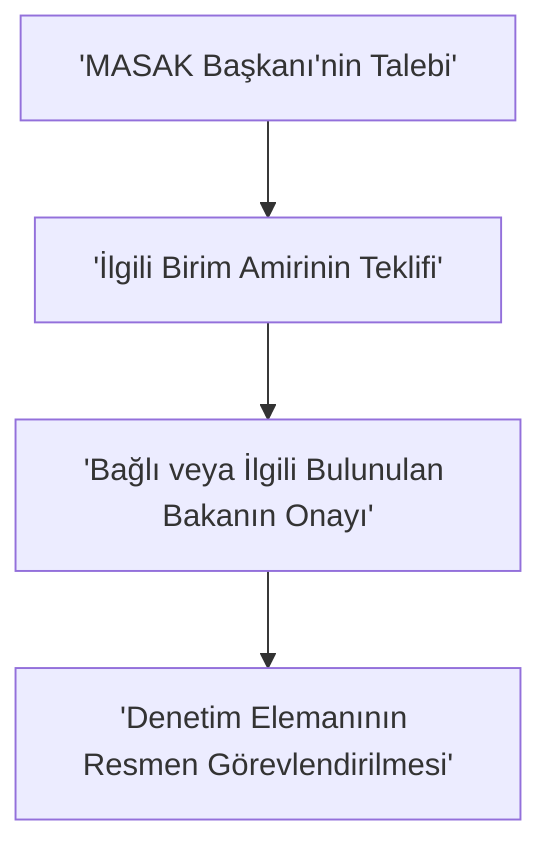

# 📌 MASAK’ın Kuruluşu, Görevleri ve Yasal Yetkileri [Hukuki Çerçeve]

### 🎯 Bu Bölüm Ne Anlatıyor?
Bu bölüm; mali sistemimizin koruyucu kalkanı olan **Mali Suçları Araştırma Kurulu Başkanlığı'nın (MASAK)** yasal kökenlerini, kime bağlı çalıştığını, geniş yetki sınırlarını, suç gelirlerinin aklanması (kara para aklama) suçunun aşamalarını, cezalarını, yöntemlerini ve suçtan elde edilen değerlere el koyma süreçlerini inceler. Sınavda doğrudan soru potansiyeli taşıyan süreler, yetkili mercilere ait detaylar ve cezai yaptırımlar bu bölümün kalbidir.

---

## 🏢 Konu 1: MASAK'ın Kuruluşu, Teşkilat Yapısı ve Fonksiyonları [Hukuki Çerçeve]

Mali suçlarla mücadelede Türkiye'nin mali istihbarat birimi (FIU) olan MASAK, idari ve hukuki olarak çok özel bir konuma sahiptir. Sınavda en çok düşülen tuzaklardan biri MASAK'ın bağlı olduğu makamdır. Unutma: MASAK bağımsız bir cumhurbaşkanlığı birimi değildir, doğrudan bakana bağlıdır!

*   **MASAK (Mali Suçları Araştırma Kurulu Başkanlığı):** Doğrudan **Hazine ve Maliye Bakanı’na** bağlı olarak çalışan mali istihbarat birimidir. → 💡 *Mali sistemin dedektifi, doğrudan Hazine ve Maliye Bakanı'nın sağ kolu!*
*   **4208 Sayılı Kanun (Kuruluş Kanunu):** 19.11.1996 tarihinde yürürlüğe giren ve MASAK'ın kurulmasını sağlayan 'Karaparanın Aklanmasının Önlenmesine Dair Kanun'dur. MASAK, bu kanunla kurulmuş ve **17 Şubat 1997** tarihinde fiilen faaliyetine başlamıştır. → 💡 *MASAK'ın doğum sertifikası.*
*   **5549 Sayılı Kanun:** 18.10.2006 tarihinde yürürlüğe giren 'Suç Gelirlerinin Aklanmasının Önlenmesi Hakkında Kanun'dur. MASAK'ın görev ve yetkilerini modern finansal ihtiyaçlara göre yeniden belirlemiştir. → 💡 *MASAK'ın bugünkü operasyonel gücünün arkasındaki ana kanun.*
*   **1 Sayılı Cumhurbaşkanlığı Kararnamesi (Madde 231):** MASAK'ın görev ve yetkilerinin hâlihazırda düzenlendiği, 10.07.2018 tarihli ve 30474 sayılı Resmî Gazete’de yayımlanan mevzuattır. → 💡 *MASAK'ın güncel teşkilat yapısının anayasal dayanağı.*
*   **Geçici Personel Görevlendirilmesi:** Bilgi ve ihtisasına ihtiyaç duyulması halinde, diğer kamu kurum ve kuruluşlarında çalışanların Başkanlık bünyesinde geçici olarak görevlendirilmelerini talep etme yetkisidir.
    - 💡 *Benzetme:* MASAK'ın 'Yenilmezler (Avengers)' ekibi kurması gibi; başka kurumdaki süper uzmanı geçici olarak kendi bünyesine transfer etmesi!
    - 🎬 *Mikro-Senaryo - Vergi Uzmanının Transferi:* MASAK, karmaşık bir vergi aklama dosyasını çözmek için Gelir İdaresi Başkanlığı'nda çalışan kıdemli vergi uzmanı Mehmet Bey'in geçici olarak kendi bünyesinde görevlendirilmesini talep eder ve Mehmet Bey geçici olarak MASAK'ta çalışmaya başlar.
*   **İl Temsilcilikleri Kurulması:** Başkanlığın görev alanıyla ilgili Bakanın (Hazine ve Maliye Bakanı) onayıyla gerekli görülen illerde temsilcilikler kurulabilir.
    - 💡 *Benzetme:* MASAK'ın yerel şubeler açarak suçlulara yerinde göz açtırmaması.
    - 🎬 *Mikro-Senaryo - Antalya Temsilciliği:* Turizm bölgelerindeki şüpheli nakit akışlarını yerinde izlemek amacıyla, Hazine ve Maliye Bakanı'nın onayıyla Antalya'da bir MASAK temsilciliği kurulur.
*   **Yabancı Ülke Denetim Yetkisi ve Karşılıklılık İlkesi:** Yabancı ülke kanunlarına göre yükümlülük denetimine yetkili mercilerin, merkezi yurtdışında bulunan yükümlülerinin Türkiye’deki birimleri nezdinde yükümlülük denetimi yapmasına ve bu kapsamdaki bilgi taleplerinin cevaplandırılmasına karşılıklılık ilkesi de dikkate alınarak izin vermektir.
    - 💡 *Benzetme:* 'Sen benim bahçemi denetlersen, ben de senin bahçeni denetlerim' diplomasisi.
    - 🎬 *Mikro-Senaryo - Alman Denetim Otoritesi:* Almanya'daki finansal denetim otoritesi, Türkiye'deki bir Alman banka şubesinde denetim yapmak ister. MASAK, karşılıklılık ilkesini gözeterek bu denetime izin verir.
*   **Yurtdışı Birimlerin Denetimi:** Gerekli hallerde merkezi Türkiye’de bulunan yükümlülerin yurtdışındaki birimleri nezdinde yükümlülük denetimi yapmak ve bilgi talep etmektir.
    - 🎬 *Mikro-Senaryo - Türk Bankasının Londra Şubesi:* Merkezi İstanbul'da olan bir Türk bankasının Londra şubesinde şüpheli işlemler tespit edilir. MASAK, doğrudan Londra şubesi nezdinde yükümlülük denetimi yapar ve bilgi talep eder.

🎬 **Senaryo / Hikaye - Ahmet Bey'in Şüpheli İşlemi ve MASAK'ın Devreye Girmesi:** Ahmet Bey, kaynağını açıklayamadığı 15.000.000 TL nakit parayı bir banka şubesine yatırmak ister. Bankadaki uyum görevlisi bu durumdan şüphelenir ve durumu derhal MASAK'a bildirir. MASAK, 1 sayılı Cumhurbaşkanlığı Kararnamesi'nin 231. maddesinden aldığı yetkiyle bu veriyi toplar, analiz eder ve gerekirse Cumhuriyet Savcılığına intikal ettirir.

### 🔍 Denetim Elemanlarının Görevlendirilme Usulü
MASAK, görev alanına giren konuların araştırılması ve incelenmesini hazine ve maliye uzmanları/uzman yardımcılarının yanı sıra denetim elemanları vasıtasıyla yerine getirir. Sınavda bu görevlendirmenin nasıl yapıldığı adım adım sorulur:



📌 **Denetim Elemanlarının Yetkileri:** Görevlendirilen uzmanlar ve denetim elemanları; görevlendirme konusuna giren hususlarda kamu kurumlarından, gerçek ve tüzel kişilerden bilgi ve belge istemeye, araştırma ve inceleme yapmaya, uygulamayı takip ve denetlemeye, bu maksatla her türlü evrakı tetkike yetkilidir.

### 🌐 Uluslararası İlişkiler ve Mutabakat Muhtıraları (MOU)
MASAK, yabancı ülkelerdeki muadil kurumlarla (mali istihbarat birimleriyle) bilgi değişimini sağlamak amacıyla uluslararası anlaşma niteliğinde olmayan **Mutabakat Muhtıraları (MOU)** imzalayabilir.
*   **İmzalama ve Değiştirme Yetkisi:** Doğrudan **Mali Suçları Araştırma Kurulu Başkanı'na** aittir.
*   **Yürürlüğe Girme Şartı:** İmzalanan mutabakat muhtıraları ve değişiklikleri ancak **Cumhurbaşkanı kararıyla** yürürlüğe girer.

📊 **Tablo 1: MASAK'ın İcra Ettiği 6 Temel Fonksiyon**

| Fonksiyon | Açıklama |
| :--- | :--- |
| **Politika Belirleme ve Mevzuat Geliştirme** | Aklama ve terörün finansmanını önlemek için plan, program ve strateji hazırlar. |
| **Veri Toplama, Analiz ve Değerlendirme** | Şüpheli işlem bildirimlerini (ŞİB) alır, kaydeder, analiz eder ve istihbarat üretir. |
| **Yükümlülük Denetimi** | Finansal kuruluşların ve diğer yükümlülerin kanuna uyumunu denetler veya denetlenmesini sağlar. |
| **Koordinasyon** | Kurum ve kuruluşlar arasında ulusal düzeyde risk değerlendirme çalışmaları dahil koordinasyonu sağlar. |
| **İnceleme** | Suç gelirlerinin aklanması ve terörün finansmanı suçlarına ilişkin araştırma ve inceleme yapar. |
| **Dış İlişkiler** | Uluslararası ilişkileri yürütür, muadil yabancı kurumlarla bilgi alışverişinde bulunur. |

---

## 🏢 Konu 2: Suç Gelirlerinin Aklanması: Unsurlar ve Aşamalar [Hukuki Çerçeve]

Suç gelirlerinin aklanması, yasa dışı yollardan elde edilen kazançlara yasal bir görünüm kazandırma sürecidir. Türk Ceza Kanunu (TCK) Madde 282, bu suçu ve unsurlarını net bir şekilde tanımlamıştır.

*   **Aklama Fiili (TCK Madde 282):** Alt sınırı altı ay veya daha fazla hapis cezasını gerektiren bir suçtan kaynaklanan malvarlığı değerlerini, yurt dışına çıkaran veya bunların gayrimeşru kaynağını gizlemek veya meşru bir yolla elde edildiği konusunda kanaat uyandırmak maksadıyla, çeşitli işlemlere tâbi tutan kişinin cezalandırıldığı fiildir. → 💡 *Kirli parayı finansal çamaşır makinesinde yıkayıp temiz göstermek.*
*   **Öncül Suç (Predicate Offense):** Aklama suçunun oluşabilmesi için öncelikle işlenmiş ve suç geliri üretmiş olması gereken ana suçtur. Bu suçun yasal sınır çizgisi **alt sınırının en az 6 ay veya daha fazla hapis cezası** olmasıdır. → 💡 *Yumurta olmadan omlet olmaz; öncül suç olmadan aklama suçu oluşmaz!*
*   **Suç Geliri:** Öncül suç sonucunda elde edilen her türlü ekonomik menfaat, değer ve yasa dışı yollardan sağlanan kazançtır.

🎬 **Senaryo / Hikaye - Mehmet Bey'in Yasa Dışı Bahis Kazancı ve Aklama Girişimi:** Mehmet Bey, yasa dışı bahis oynatarak (alt sınırı 6 aydan fazla hapis gerektiren bir öncül suç) 10.000.000 TL haksız kazanç elde eder. Bu parayı meşru göstermek için paravan bir temizlik şirketi kurar ve parayı şirketin geliriymiş gibi bankaya yatırır. Mehmet Bey burada hem öncül suç işlemiş hem de suç gelirini aklama (TCK 282) suçunu işlemiştir.

### 🧺 Aklama Fiilinin 3 Altın Aşaması (Y-A-B)
Aklama süreci akademik ve pratik olarak üç temel aşamadan oluşur. Sınavda bu aşamaların tanımları ve sırası sıklıkla sorulur.

```mermaid
graph LR;
    A['1. YERLEŞTİRME <br> (Nakit parayı sisteme sokma)'] --> B['2. AYRIŞTIRMA <br> (İzleri kaybetmek için hesaplar arası döndürme)']
    B --> C['3. BÜTÜNLEŞTİRME <br> (Temiz para olarak ekonomiye geri kazandırma)']
```

1.  **Yerleştirme (Placement):** Suçtan elde edilen nakit paranın fiziksel olarak finansal sisteme sokulması aşamasıdır. → 💡 *Kirli parayı çamaşır makinesine atmak.*
2.  **Ayrıştırma (Layering):** Paranın yasadışı kaynağından olabildiğince uzaklaştırılması, izinin sürülmesini zorlaştırmak amacıyla çok sayıda karmaşık finansal işleme (hesaplar arası transferler, offshore hesaplar vb.) tabi tutulmasıdır. → 💡 *Makineyi yüksek devirde döndürüp renkleri birbirine karıştırmak.*
3.  **Bütünleştirme (Integration):** Kaynağından tamamen koparılan ve temizlenen suç gelirinin, yasal yatırımlar (gayrimenkul, lüks araç alımı, şirket ortaklığı) aracılığıyla ekonomiye meşru para olarak geri kazandırılmasıdır. → 💡 *Yıkanan çamaşırı askıya asıp gururla sergilemek.*

---

## 🏢 Konu 3: Cezai Yaptırımlar ve Aklama Yöntemleri [Hukuki Çerçeve]

Aklama suçuna iştirak edenlerin, yardım edenlerin veya mesleki kolaylık sağlayanların cezaları kanunda kademeli olarak artırılmıştır.

📊 **Tablo 2: TCK Madde 282 Cezalar ve Nitelikli Haller Matrisi**

| Kanun Maddesi | İşlenen Fiil | Öngörülen Ceza / Yaptırım |
| :--- | :--- | :--- |
| **Madde 282/1** | Suç gelirini aklama (Yurt dışına çıkarma veya gayrimeşru kaynağı gizlemek için işleme tabi tutma) | **3 yıldan 7 yıla kadar hapis** ve **20.000 güne kadar adli para cezası** |
| **Madde 282/2** | Suça iştirak etmeksizin, bu özelliğini bilerek malvarlığı değerini edinen, kabul eden, bulunduran veya kullanan | **2 yıldan 5 yıla kadar hapis cezası** |
| **Madde 282/3** | Suçun **kamu görevlisi** veya **belirli bir meslek sahibi** (örn. bankacı, noter) tarafından mesleğin icrası sırasında işlenmesi | Verilecek ceza **yarı oranında artırılır** |
| **Madde 282/4** | Suçun bir **örgüt faaliyeti** çerçevesinde işlenmesi | Verilecek ceza **bir kat oranında artırılır** |
| **Madde 282/5** | Suçun **tüzel kişiler** (şirketler, vakıflar) yararına işlenmesi | Tüzel kişiler hakkında bunlara özgü güvenlik tedbirleri uygulanır (**lisans iptali, kayyum tayini**) |
| **Madde 282/6** | **Etkin Pişmanlık** (Kovuşturma başlamadan önce suç konusu değerlerin ele geçirilmesini sağlayan veya yerini bildiren) | **Ceza verilmez** |

🎬 **Senaryo / Hikaye - Kamu Görevlisi Fatma Hanım'ın Mesleki İhlali:** Bir bankada şube müdürü olan Fatma Hanım, yakın arkadaşı Ayşe Hanım'ın getirdiği 5.000.000 TL'lik şüpheli nakit paranın suç geliri olduğunu bilmesine rağmen, mesleğinin sağladığı kolaylığı kullanarak bu parayı sisteme sokar. Normalde aklama suçunun cezası 3-7 yıl hapis iken, Fatma Hanım bu suçu mesleğinin icrası sırasında işlediği için cezası yarı oranında artırılır (TCK 282/3).

### 💸 Aklama Yöntemleri: Geleneksel vs. Modern
Suçlular parayı aklamak için sürekli yeni yöntemler geliştirirler. Sınavda 'Aşağıdakilerden hangisi modern/geleneksel aklama yöntemidir?' sorusu klasikleşmiştir.

*   **Geleneksel Yöntemler:**
    *   *Fiziki Kaçakçılık:* Fonların fiziken ülke dışına kaçırılması.
    *   *Şirinler (Smurfing) Yöntemi:* Büyük bir fonun, bildirim sınırlarının altında kalacak şekilde çok sayıda kişiye (şirinlere) dağıtılarak farklı hesaplardan sisteme sokulması.
    *   *Parçalama (Structuring) Yöntemi:* Yüksek tutarlı fonun, tek bir kişi tarafından bildirim sınırlarının altında kalacak şekilde küçük tutarlara bölünerek yatırılması.
    *   *Vergi Cennetleri (Off-shore):* Denetimin az olduğu ülkelerde hesap açılması.
    *   *Paravan Şirketler:* Kağıt üstünde var olan ama fiilen çalışmayan hayali şirketler.
    *   *Oto-Finans Borç Yöntemi (Loan-back):* Kişinin yurt dışına çıkardığı kirli parayı, kendi kurduğu yabancı şirketten borç alıyormuş gibi ülkeye geri sokması.
    *   *Kumarhaneler ve Gazinolar:* Nakit paranın fişe çevrilip oyun oynanmış gibi gösterilerek temiz nakit olarak geri alınması.
    *   *Nakit para kullanılan işyerlerinin işletilmesi (Göstermelik şirketler):* Nakit akışının yoğun olduğu (oto yıkama, restoran vb.) işyerleri açarak kirli parayı bu işyerinin yasal kazancıymış gibi göstermek.
        - 💡 *Benzetme:* Breaking Bad dizisindeki oto yıkama dükkanı!
        - 🎬 *Mikro-Senaryo - Can Bey'in Dönercisi:* Can Bey, yasa dışı yollardan kazandığı nakit paraları aklamak için çok yoğun bir dönerci dükkanı açar. Gerçekte günde 100 döner satılırken, defterde 1000 döner satılmış gibi gösterilerek aradaki farkı nakit olarak kasaya ekler ve kirli parayı döner satış geliri gibi sisteme yerleştirir. Böylece kirli para mis gibi döner kokusuyla sisteme sızmış olur!
    *   *Sahte Fatura (Hayali İhracat):* Gerçekte var olmayan mal ticaretine ilişkin faturalar düzenleyerek parayı sisteme sokmak.
    *   *Alternatif Havale Sistemleri (Hawala vb.):* Resmi bankacılık sistemi dışından, güvene dayalı yerel aracılar vasıtasıyla fon transferi yapmak.
    *   *İnternet Bankacılığı ve Elektronik Para:* Dijital kanalları kullanarak hızlı ve çoklu işlemlerle paranın izini kaybettirmek.

*   **Modern Yöntemler:**
    *   *Kripto Varlık Kullanımı:* Kripto paraların anonimlik veya takipsizlik özelliklerinden faydalanarak paranın izini kaybettirmek.
        - 💡 *Benzetme:* Parayı dijital bir hayalet pelerinine büründürmek!
        - 🎬 *Mikro-Sen